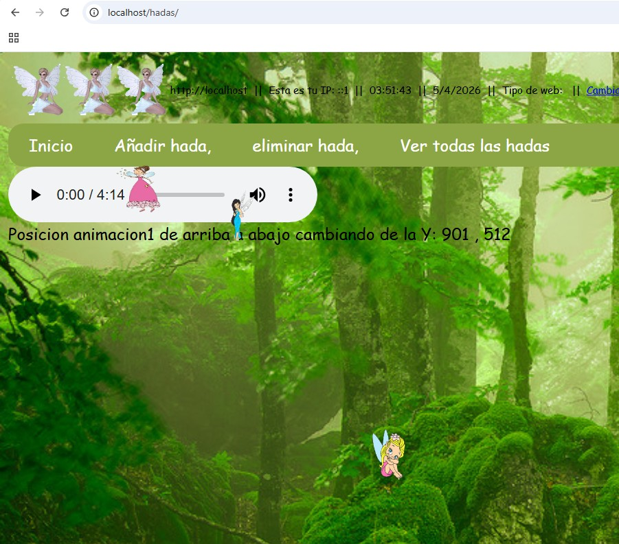

# ¿Que es hadas?

Es una web de relax en la que puedes ir añadiendo hadas mientras suena una música

<a href="hadas.tipolisto.es"> pruebala npichando akí</a>

# Instalación

1. descarga XAMPP

2. Ejecuta XAMPP control panel y activa php y mysql

3. En tu navegador web ve a http://localhost/phpmyadmin/ y crea la base de datos hadas.

4. importa el archivo schema.sql para crear las tablas hada y hadaseleccionada

5. Listo, ve a http://localhost/hadas/
